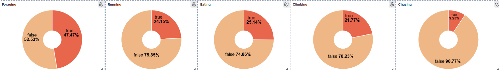
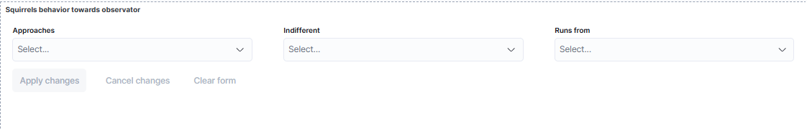
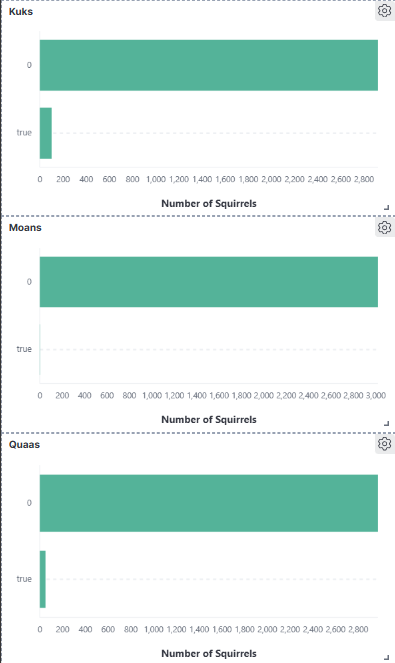
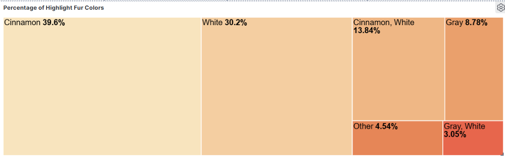
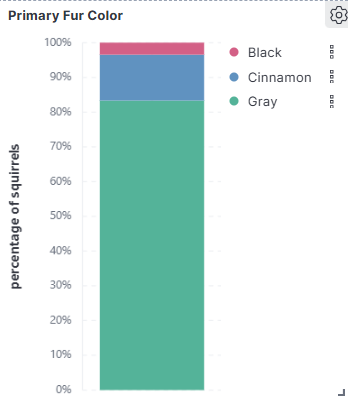
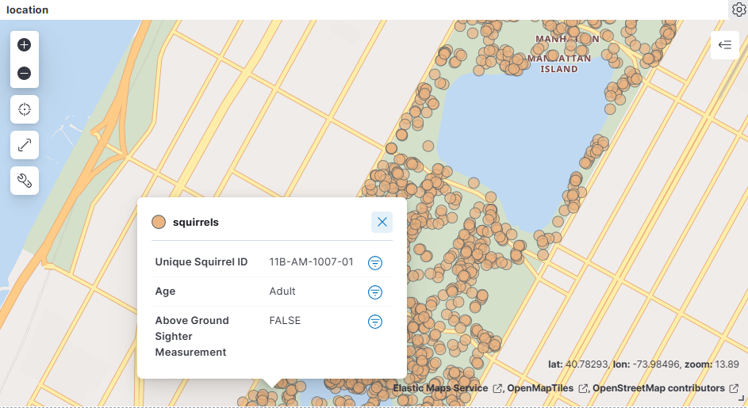

# Projet d'Analyse des Écureuils - Dataset de Central Park

## Description
Ce projet utilise les données d'observation des écureuils dans Central Park, New York. Grâce à l'analyse des comportements, des caractéristiques physiques et de la localisation des écureuils, nous avons créé des visualisations pour mieux comprendre leur mode de vie.

L'analyse a été réalisée à l'aide de Kibana, avec un tableau de bord interactif permettant de filtrer les observations selon plusieurs critères.

## Objectifs
- Analyser les comportements des écureuils (foraging, running, climbing, etc.).
- Comprendre les caractéristiques physiques comme les couleurs de pelage.
- Étudier les interactions des écureuils avec les observateurs humains.
- Analyser la répartition géographique et temporelle des observations.

## Fonctionnalités Principales
- **Filtres interactifs** pour explorer les comportements des écureuils (approche, indifférence, fuite).
- **Visualisation des comportements** : Recherche de nourriture, course, grimpe, etc.
- **Analyse des couleurs de pelage** : Treemap et diagrammes pour comprendre la répartition des couleurs.
- **Données géospatiales** : Carte de la répartition géographique des écureuils dans Central Park.

## Qlqs captures d'écran du Tableau de Bord

### Tableau de bord général


### Répartition des Comportements




### Couleurs de pelage des écureuils




### Répartition géographique des écureuils


## Statistiques Clés
- **3023** écureuils uniques observés.
- **47.47%** des écureuils impliqués dans la recherche de nourriture.
- **88.61%** des écureuils sont des adultes.
- **39.6%** des écureuils ont une fourrure de couleur "Cannelle".

## Installation et Utilisation
### Prérequis
- Docker pour lancer les conteneurs : ElasticSearch et Kibana 
- Kibana pour visualiser les données.
- Fichiers de données du Central Park Squirrel Census.

### Étapes d'installation
1. Clonez ce dépôt GitHub :
   ```bash
   git clone https://github.com/oumaimaab01/Squirrels-Dashboard-with-KIBANA.git

2. Lancer les conteneurs :
   ```bash
   docker-compose up
   
3. Accèder à kibana via [le port ](http://localhost:5601/)
   
